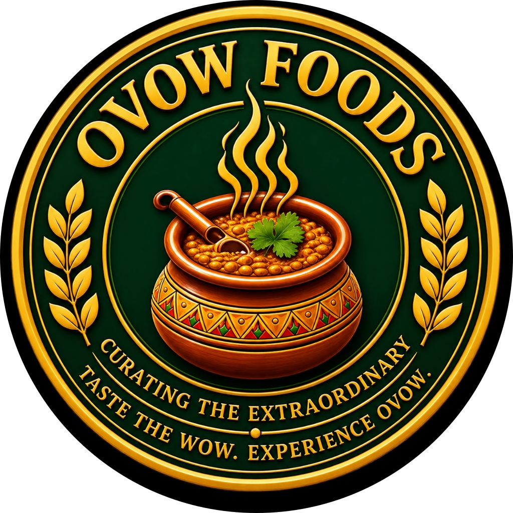

<div align="center">
  
  
  # OVOW FOODS
  
  **A World-Class Culinary Experience & E-Commerce Platform**
  
  [Live Demo](#) · [Report Bug](#) · [Request Feature](#)
</div>

---

## 🍽️ About The Project

OVOW FOODS is a premium web application built for a high-end culinary brand. Designed with a focus on immersive user experience (UX) and stunning user interfaces (UI), it bridges the gap between a visual portfolio and a functional e-commerce platform.

The platform features seamless animations, cinematic video galleries, an integrated shopping cart, and a direct-to-WhatsApp ordering system, all powered by a headless CMS for effortless content management.

### ✨ Key Features

* **Cinematic Video Gallery:** A masonry-style gallery featuring auto-playing video previews and seamless, borderless fullscreen lightbox expansions powered by Framer Motion's shared layout API.
* **Premium Menu System:** Beautifully presented food items with category filtering, add-to-cart functionality, and detailed product pages.
* **WhatsApp Ordering:** A frictionless checkout experience that compiles the user's cart into a formatted WhatsApp message, sending it directly to the business for fulfillment.
* **Headless CMS Integration:** Full integration with Sanity Studio, allowing non-technical staff to update menus, manage gallery videos, and review bulk order submissions.
* **Party & Bulk Orders:** Dedicated inquiry forms for catering and large events.
* **Beast UI / Glassmorphism:** Implementation of modern web design trends, including frosted-glass navigation bars, smooth spring animations, and tactile micro-interactions.

---

## 🛠️ Built With

This project is built using the bleeding edge of modern web development frameworks and libraries:

* **Framework:** [Next.js 15](https://nextjs.org/) (App Router, React 19)
* **Styling:** [Tailwind CSS v4](https://tailwindcss.com/)
* **Animations:** [Framer Motion](https://www.framer.com/motion/)
* **Icons:** [Lucide React](https://lucide.dev/)
* **Headless CMS:** [Sanity.io](https://www.sanity.io/)
* **Language:** [TypeScript](https://www.typescriptlang.org/)

---

## 🚀 Getting Started

To get a local copy up and running, follow these simple steps.

### Prerequisites

You will need Node.js installed on your machine.
* npm
  ```sh
  npm install npm@latest -g
  ```

### Installation

1. Clone the repo
   ```sh
   git clone https://github.com/Hetsoni28/OVOW_FOODS.git
   ```
2. Install NPM packages
   ```sh
   npm install
   ```
3. Set up your environment variables
   Create a `.env.local` file in the root directory and add your Sanity credentials:
   ```env
   NEXT_PUBLIC_SANITY_PROJECT_ID=your_project_id
   NEXT_PUBLIC_SANITY_DATASET=production
   ```
4. Run the development server
   ```sh
   npm run dev
   ```
5. Open your browser and navigate to `http://localhost:3000`.

---

## 🏗️ Project Architecture

* `/app` - Next.js App Router pages (Home, Menu, Gallery, Party Bulk Orders, Studio).
* `/components` - Reusable UI components organized by Atomic Design principles (`atoms`, `molecules`, `organisms`, `layout`).
* `/sanity` - Sanity CMS schema definitions, queries, and client configuration.
* `/lib` - Utility functions, animation variants, and global configurations (e.g., WhatsApp formatting).
* `/context` - React Context providers (e.g., Cart state management).

---

## 📦 Content Management (Sanity Studio)

This project uses Sanity.io for content management. You can access the CMS dashboard locally by navigating to:
`http://localhost:3000/studio`

From here, administrators can manage:
- **Products:** Add, edit, or remove menu items, adjust pricing, and upload images.
- **Gallery:** Upload cinematic videos and assign categories.
- **Reviews:** Manage customer testimonials displayed on the homepage.
- **Site Settings:** Update global configurations like phone numbers and social links.

---

## 📱 Mobile Responsiveness

The platform is strictly mobile-first, ensuring that the heavy animations, masonry grids, and bottom-navigation cart systems work flawlessly on devices of all sizes, maintaining a 60fps cinematic feel even on standard smartphones.

---

<div align="center">
  <i>Designed & Developed for OVOW FOODS.</i>
</div>
